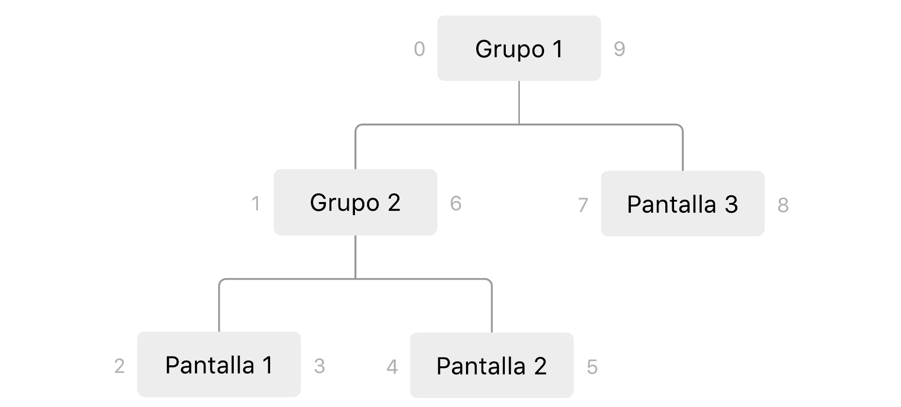

# Digital Signage - Cooperativa

La idea del desarrollo es poder mostrar contenido (imagenes, videos, etc) en distintas pantallas de la forma mas sencilla posible, sin conocimientos tecnicos por parte del usuario. Si quisiera mostrar una serie de imagenes por pantalla, los pasos a seguir (a grandes rasgos) serian los siguientes:

1. Subir imagenes al sistema
2. Crear una playlist que contenga esas imagenes
3. Asignar esa playlist a una o mas pantallas

Todos esos pasos se realizan desde el __administrador__, donde se organiza el contenido y se lo asigna a las distintas __pantallas__. 

## Arquitectura general

El back-end otorga las vistas al administrador y a las pantallas, y ademas brinda acceso a la API del sistema para la creacion de playlists, agregado de nuevas pantallas, edicion de su contenido, etc. 

Para la comunicacion en tiempo real entre el administrador y las pantallas (para avisar a una pantalla que su contenido fue modificado por ejemplo) se utiliza comunicacion via web-sockets, evitando un sistema de polling constante y anunciando cambios solo cuando es necesario.

El __udid__ (Unique Device Identifier) es parte del hardware de cada una de las pantallas y permite al servidor reconocer de forma unívoca a cada una (sobreviviendo a desconexiones, a diferencia de como lo haria la IP por ejemplo) y asi saber qué vista enviar a cada una. 

La idea de presentar el contenido de cada pantalla como simples _paginas web_ se basa en evitar el desarrollo de aplicaciones completas nativas para distintas plataformas, y hacer que lo maximo que se requiera de forma nativa es una aplicacion que muestra una vista web con el url del servidor y el udid correspondiente. En su version mas sencilla, cualquier dispositivo con un buscador alcanzaría para presentar contenido.

## Organizacion de las pantallas

Ademas de poder asignar contenido a cada pantalla individualmente, se implemento un sistema de grupos analogo a un sistema de carpetas y archivos, a fin de poder editar el contenido de varias pantallas a la vez (por ej: todas aquellas en el grupo "cajas" muestren la playlist tal) entre otras cosas. Las pantallas se pueden juntar en grupos, dentro de los cuales pueden haber a su vez mas subgrupos y pantallas. Internamente esto se mantiene en la base de datos usando una implementacion de jerarquias conocida como __nested sets__ (explicada excelentemente por [Myke Hillyer aca](http://mikehillyer.com/articles/managing-hierarchical-data-in-mysql/)).

## Instalacion y primer uso

__Creacion e inicializacion de la Base de Datos__

1. Crear base de datos con el nombre `signage`
2. Crear tablas y vistas base a partir del [codigo adjunto](documentacion/db_definition.sql)
3. Crear [contenido para el demo](documentacion/db_demo_items.sql)

__Servidor de WebSockets__

1. Descargar el [codigo correspondiente](https://github.com/AgustinBrst/Websockets_server)
   `git clone https://github.com/AgustinBrst/Websockets_server.git`
2. Instalar dependencias 
   `npm install`
3. Iniciar el servidor
   `npm run server`

__Back-end__

1. Descargar el [codigo correspondiente](https://github.com/AgustinBrst/Websockets_server)
   `git clone https://github.com/AgustinBrst/Signage.git`
2. Instalar dependencias 
   `npm install`
3. Iniciar servidor php local
   `php -S 0.0.0.0:8000`
4. Iniciar servidor Webpack local (webpack-dev-server)
   `npm run server`

__Accediendo al administrador y las pantallas__

Para acceder al administrador abrir el buscador e ir a [`http://localhost:8000/index.php/signage/admin`](http://localhost:8000/index.php/signage/admin), donde se puede ver que se inicializo el sistema con un set de grupos y pantallas como el del ejemplo en _Organizacion de las pantallas_, junto con algunas playlists e imagenes.

Respecto a las pantallas, durante la inicializacion de la base de datos se crearon tres, cada una con su _udid_ unico (`123`, `456` y  `789` respectivamente), cuyo contenido se puede acceder en un buscador yendo a [`http://localhost:8000/index.php/signage/screen/789`](http://localhost:8000/index.php/signage/screen/789) (si se mira el final del url, se puede ver que en este caso se estaria accediando a la _Pantalla 3_). La aplicacion que estaria corriendo en un SmartTV con Android por ejemplo, no termina haciendo mas que acceder a una url similar con su _udid_ propio (al estilo .

## Esquema de la Base de Datos

## Agregando nuevas pantallas

## Comunicacion via Web Sockets

