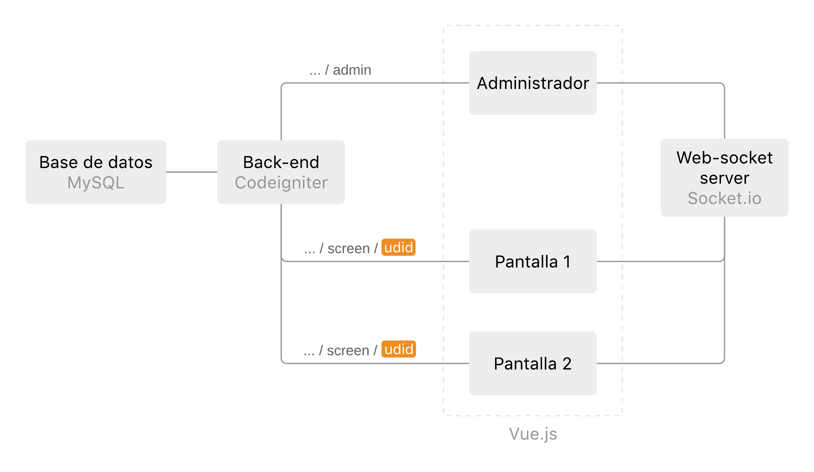
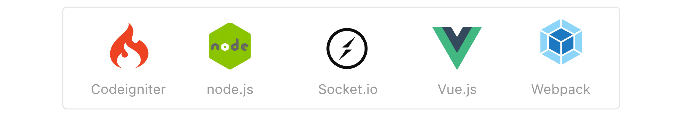
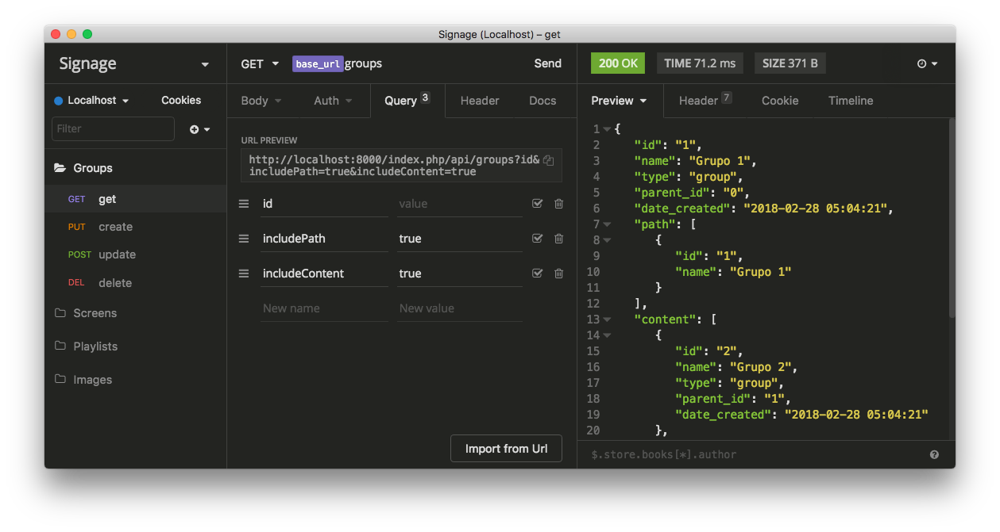

# Digital Signage - Cooperativa


__Tabla de contenidos__

- [Introducción](#introducción)
- [Arquitectura general](#arquitectura-general)
- [Organización de las pantallas](#organización-de-las-pantallas)
- [Instalación y primer uso](#instalación-y-primer-uso)
- [Agregando nuevas pantallas](#agregando-nuevas-pantallas)
- [Esquema de la Base de Datos](#esquema-de-la-base-de-datos)
- [API](#api)
- [Cliente Android](#cliente-android)
- [Referencias](#referencias)


__Repos relacionados__

- [Servidor de websockets](https://github.com/AgustinBrst/Websockets_server.git)
- [Aplicacion cliente para Android](https://github.com/AgustinBrst/Android_client.git)


## Introducción

La idea del desarrollo es poder mostrar contenido en distintas pantallas de la forma mas sencilla posible, sin conocimientos técnicos por parte del usuario. Si quisiera mostrar una serie de imágenes por pantalla, los pasos a seguir (a grandes rasgos) serian los siguientes:

1. Subir imágenes al sistema.
2. Crear una playlist que contenga esas imágenes.
3. Asignar esa playlist a una pantalla.

Todos esos pasos se realizan desde el __administrador__, donde se organiza el contenido y se lo asigna a las distintas __pantallas__. 


## Arquitectura general

El back-end otorga las vistas al administrador y a las pantallas, y ademas brinda acceso a la API del sistema para la creacion de playlists, agregado de nuevas pantallas, edicion de su contenido, etc. 

Para la comunicacion en tiempo real entre el administrador y las pantallas (para avisar a una pantalla que su contenido fue modificado por ejemplo) se utiliza comunicacion via web-sockets, evitando un sistema de polling constante y anunciando cambios solo cuando es necesario.



El __udid__ (Unique Device Identifier) es parte del hardware de cada una de las pantallas y permite al servidor reconocer de forma unívoca a cada una (sobreviviendo a desconexiones, a diferencia de como lo haría la IP por ejemplo) y así saber qué vista enviar a cada una. 

La idea de presentar el contenido de cada pantalla como simples _paginas web_ se basa en evitar el desarrollo de aplicaciones completas nativas para distintas plataformas, y hacer que lo máximo que se requiera de forma nativa es una aplicación que muestra una vista web con el url del servidor y el udid correspondiente. En su versión mas sencilla, cualquier dispositivo con un buscador alcanzaría para presentar contenido.

__Tecnologias usadas__




## Organizacion de las pantallas

Ademas de poder asignar contenido a cada pantalla individualmente, se implemento un sistema de grupos análogo a un sistema de carpetas y archivos, a fin de poder editar el contenido de varias pantallas a la vez (por ej: todas aquellas en el grupo verdulería muestren la playlist _frutas de época) entre otras cosas. Las pantallas se pueden juntar en grupos, dentro de los cuales pueden haber a su vez mas subgrupos y pantallas. Internamente esto se mantiene en la base de datos usando una implementación de jerarquías conocida como __nested sets__ (explicada excelentemente por [Myke Hillyer](http://mikehillyer.com/articles/managing-hierarchical-data-in-mysql/)).


## Instalacion y primer uso

__Creacion e inicializacion de la Base de Datos__

1. Crear base de datos con el nombre `signage`
2. Crear tablas y vistas base a partir del [codigo adjunto](documentacion/db_definition.sql)
3. Crear [contenido para el demo](documentacion/db_demo_items.sql)

__Servidor de WebSockets__

1. Clonar el repositorio correspondiente

   `git clone https://github.com/AgustinBrst/Websockets_server.git`

2. Instalar dependencias 

   `npm install`

3. Iniciar el servidor

   `npm run server`

__Back-end__

1. Clonar el repositorio correspondiente

   `git clone https://github.com/AgustinBrst/Signage.git`

2. Instalar dependencias 

   `npm install`

3. Iniciar servidor php local

   `php -S 0.0.0.0:8000`

4. Iniciar servidor Webpack local (webpack-dev-server)

   `npm run server`

__Accediendo al administrador y las pantallas__

Para acceder al administrador abrir el buscador e ir a [`http://localhost:8000/index.php/signage/admin`](http://localhost:8000/index.php/signage/admin), donde se puede ver que se inicializo el sistema con un set de grupos y pantallas como el del ejemplo en _Organización de las pantallas_, junto con algunas playlists e imágenes.

Respecto a las pantallas, durante la inicialización de la base de datos se crearon tres, cada una con su _udid_ único (`123`, `456` y  `789` respectivamente), cuyo contenido se puede acceder en un buscador yendo a [`http://localhost:8000/index.php/signage/screen/789`](http://localhost:8000/index.php/signage/screen/789) (si se mira el final del url, se puede ver que en este caso se estaría accediendo a la _Pantalla 3_). La aplicación que estaría corriendo en un SmartTV con Android por ejemplo, no termina haciendo mas que acceder a una url similar con su _udid_ propio.


## Agregando nuevas pantallas

La idea era que este proceso sea lo mas amigable posible, y se termino cayendo en la misma forma que ya se ve usada en otras soluciones de _digital signage_, cuyos pasos (partiendo de la instalación anterior) consisten en:

1. Abrir una nueva ventana del buscador con el url [`http://localhost:8000/index.php/signage/screen/`](http://localhost:8000/index.php/signage/screen/) con un `udid` agregado al final, donde este puede ser una cadena alfanumerica cualquiera (recordando que `123`, `456` y `789` ya corresponden a las pantallas que venian por defecto). La pantalla deberia pasar a mostrar un __pin de configuracion__.

   > Cabe mencionar que para el caso de ya estar usando un SmartTV, este paso consistiria de la instalacion de la aplicacion y su posterior ejecucion.

2. En el administrador, bajo la pestaña __Groups and Screens__ se presiona __+ add screen__ y se completa la informacion con el pin de la pantalla, un nombre (como "Pantalla del sector de juguetes de Star Wars") y una playlist para que esta reproduzca.

3.  Presionando __done__ se termina el proceso y la pantalla ahora ya deberia estar mostrar el contenido correspondiente a la playlist seleccionada.


## Esquema de la Base de Datos

Respecto a la organización de la información en la base de datos, en las tablas `directory`, `screens_data` y `groups_data` se mantiene la jerarquía (o directorio) de grupos y pantallas (con la implementación de _nested sets_ mencionada anteriormente), donde la primer tabla mantiene la información base común a todo _nodo_ en el directorio, mientras que la segunda y la tercera completan esa información con detalles específicos a cada tipo de nodo (_grupo_ o _pantalla_). Las vistas `groups` y `screens` unifican esa información para facilitar el acceso.

Respecto a las playtlists e imagenes, la tabla `playlists_images` es la que las contecta y mantiene su relacion _muchos a muchos_, detallando el orden de las imagenes en cada playlist (y como posible extension, la duracion de presentacion de cada una).


## API 

Durante el desarrollo de la API del sistema se uso [_Insomnia_](https://insomnia.rest) (open source y multiplataforma) para su acceso directo y testeo. En la documentación se pueden encontrar los [detalles de la API](documentacion/api_reference.md) y se provee del [workspace](documentacion/signage_workspace.json) exportado desde el programa con todos los requests ya formateados y listos para usarse.




## Cliente Android

La aplicacion cliente para Android fue desarrollada apuntando a la version KitKat (4.4) y consiste simplemente de una vista web con acceso a la url del contenido a presentar por las pantallas (`.../screen/` + `udid`), con algunas caracteristicas orientadas al uso en _digital signage_:

- Corre en modo pantalla completa, quitando menues de navegacion, barra superior, etc.
- Ante un reinicio, se ejecute de forma automatica.
- Evita que la pantalla se suspenda.

A la hora de estar usando el emulador de Android Studio, el dispositivo emulado tiene acceso al servidor local corriendo en `localhost` a travez de la IP 10.0.2.2 (de hecho, en el código de la aplicación, la url de la vista web apunta a esa IP), por lo que se debe hacer un pequeño cambio a las vistas que provee Codeigniter. En el archivo `application\view\screen.php` comentar las lineas `10` y `20` y descomentar las que les siguen.

```
10|		<base href="http://localhost:8089/">
11|		<!-- <base href="http://10.0.2.2:8089/"> -->
    ...
20|		var socketUrl = "http://localhost:4000";
21|		// var socketUrl = "http://10.0.2.2:4000";
```


## Referencias

__Librerías usadas__

- [Vue.js](https://vuejs.org)
  - [Vue-Router](https://github.com/vuejs/vue-router/)
  - [Vuex](https://github.com/vuejs/vuex/)
  - [Axios](https://github.com/axios/axios)
  - [Vue-Socket](https://github.com/MetinSeylan/Vue-Socket.io)
- [Codeigniter](https://codeigniter.com)
  - [RestServer](https://github.com/chriskacerguis/codeigniter-restserver)
  - [Validation](https://github.com/Respect/Validation)
- [Webpack](https://webpack.js.org)
- [Socket.io](https://socket.io)


__Bibliografía__

